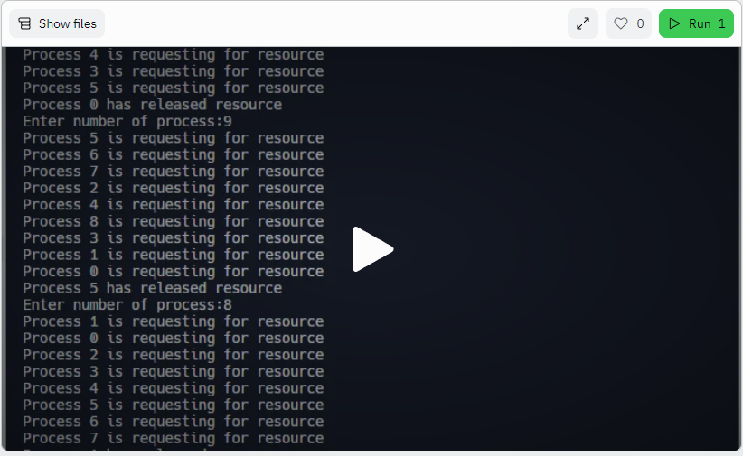
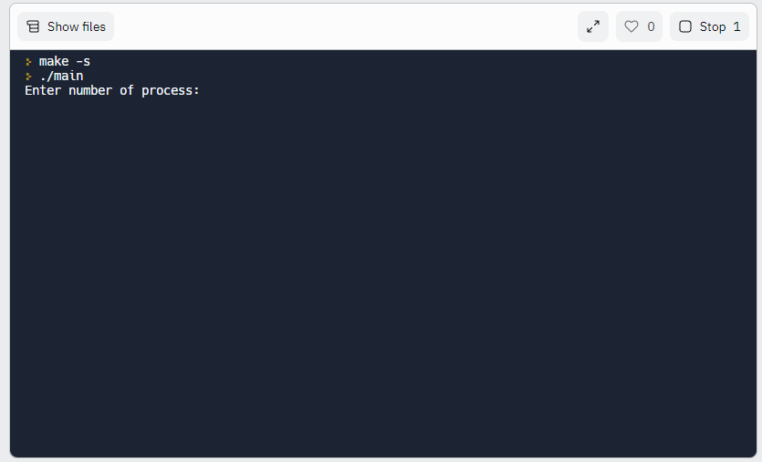
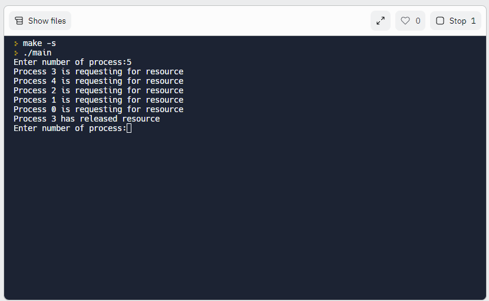
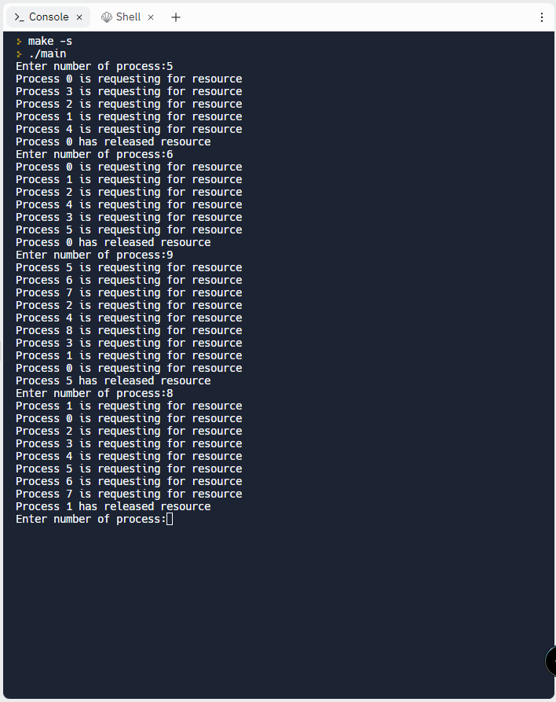

# Suzuki–Kasami Algorithm
## _The Problem Statement_
Write a program to implement the Suzuki–Kasami’s Broadcast Algorithm for implementing distributed mutual exclusion. Assume the communication channels to be FIFO in nature.

## Explanation
The program implements the following operations:
- Broadcast(m): Broadcast the message m to all processes
- Receive(pid,m): Receive a message m from process pid
- Enter_CS(): Process enters critical section
- Exit_CS(): Process exits critical section
- Test(): Test whether the process can enter the critical section or not

Note: The program takes the number of processes as input.

##### Source Code Files
->main.c
#####  Executable File
->main.exe

_The files are compiled MinGW 64 bit on Windows11 using Visual Studio Code._

##### How to run the code 


1. REPL: you can execute the code directly on the following REPL link
   https://replit.com/@biipbyte/suzuki-kasami-algorithm-Ujwal-Abhishek?v=1

   1. Enter the above link in your browser & you will be presented with following screen
      
   3. Click on the play icon in the screen above to execute the code
      
   5. You will be prompted to enter the value for number of process. Enter the value and press enter
      

Or you can also run the code locally 

2. Local: Open terminal and run main.exe file. It will prompt you to enter the number of processes

    ```sh
    cd assignment_one
    ./main.exe
    ```


# Output



## Tech

- [Language] - c
- [Compiler] - MSYS2 MinGW x64
- [OS] - Windows 11.
- [IDE] - VS Code


